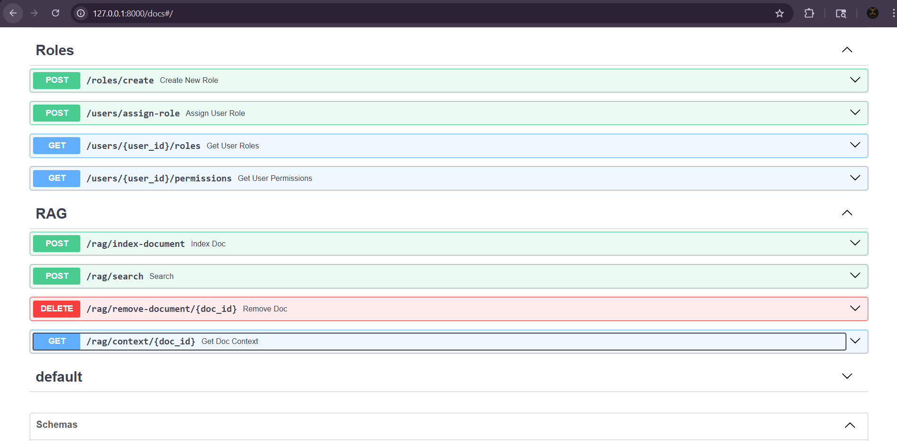
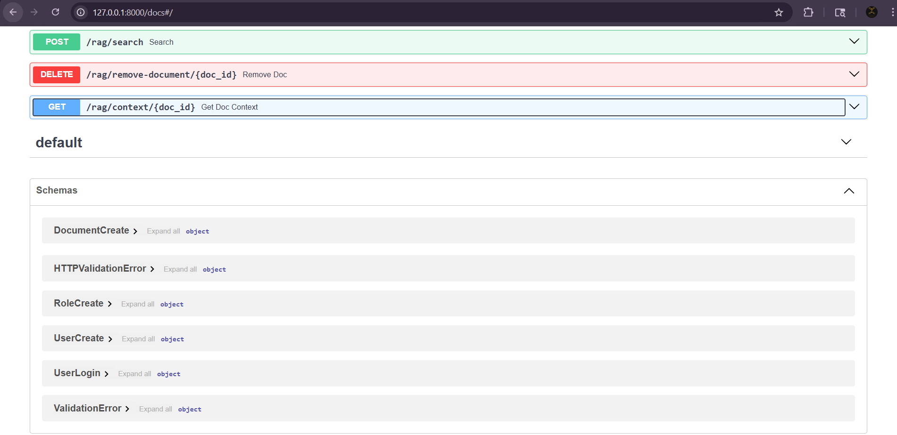

# FinDoc Manager

## Overview
FinDoc Manager is a FastAPI-based backend system for managing financial documents with semantic search capabilities.  
It allows users to store, retrieve, and analyze financial documents such as reports, invoices, and contracts using AI-powered retrieval.

---

## Features
- JWT-based user authentication  
- Financial document management (CRUD APIs)  
- Metadata-based document search  
- Role-Based Access Control (RBAC)  
- Semantic search using RAG (Qdrant + Embeddings)  

---

## Tech Stack
- FastAPI  
- SQLite (SQLAlchemy)  
- JWT Authentication  
- Qdrant (Vector Database)  
- Sentence Transformers  

---

## API Modules

### Authentication
- Register user  
- Login user  

### Documents
- Upload financial documents  
- Retrieve all documents  
- Get document by ID  
- Delete document  
- Search documents using metadata  

### RBAC (Role-Based Access Control)
- Create roles (Admin, Analyst, Auditor, Client)  
- Assign roles to users  
- View user roles and permissions  

### RAG (Semantic Search)
- Index documents into vector database  
- Perform semantic search  
- Retrieve document context  
- Remove indexed documents  

---

## RAG Workflow
Document → Chunking → Embedding → Vector Database → Retrieval → Reranking → Results

---

## How to Run

```bash
git clone <your-repo-link>
cd findoc-manager
python -m venv venv
venv\Scripts\activate
pip install -r requirements.txt
uvicorn app.main:app --reload
```

Open in browser:  
http://127.0.0.1:8000/docs

---

## Screenshots

### API Dashboard


### RBAC and RAG Endpoints


### API Schema View


---

## Author
**Prathamesh Sangole**